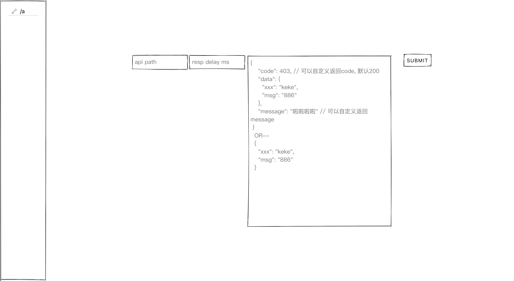
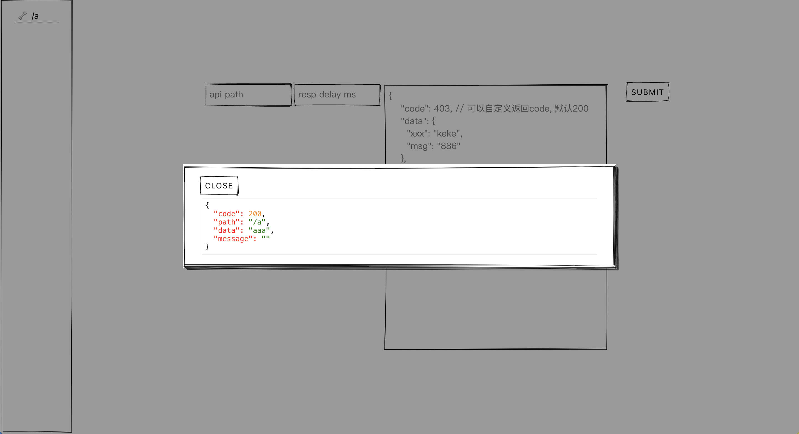

# mock data

## 使用方式

### 1. Docker

如本地已安装并启动mongodb，且使用的是mongo默认的27017端口， 可直接使用docker run 命令启动

`docker run --rm -p 3000:3000 -d  mammoth77/mock-data`

### 2. Docker Compose

如果本地没有mongodb， 可以使用docker-compose启动

- `git clone`项目
- `docker compose up`

## 开发

- `git clone ` project
- `npm i`
- `npm start`